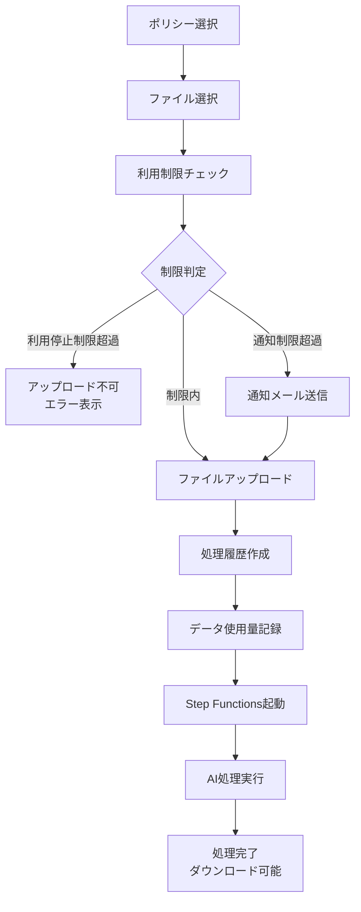

# サービスページファイルアップロード機能 - 実装完了

## 実装概要

サービスページにファイルアップロード機能を実装しました。この機能は、利用制限チェック、データ使用量記録、通知メール送信を含む完全なワークフローを提供します。

## 実装されたファイル

### 新規作成されたファイル

1. **`app/lib/actions/data-usage-api.ts`**
   - データ使用量の記録と取得API
   - 月次使用量の計算機能

2. **`app/lib/actions/usage-limit-check.ts`**
   - 利用制限のチェックロジック
   - 通知制限と利用停止制限の判定

3. **`docs/SERVICE_FILE_UPLOAD_ARCHITECTURE.md`**
   - アーキテクチャドキュメント
   - S3パス構造の詳細説明

### 更新されたファイル

1. **`app/lib/actions/email-actions.ts`**
   - 使用量通知メール送信機能を追加
   - `sendUsageLimitNotificationEmailAction()`

2. **`app/_containers/Service/ServiceFileUploader.tsx`**
   - 完全に書き直し
   - 利用制限チェック統合
   - データ使用量記録統合
   - 通知メール送信統合

3. **`app/_containers/Service/ServicePresentation.tsx`**
   - `ServiceFileUploader`コンポーネントの統合
   - 処理開始ハンドラーの実装

4. **`env.example`**
   - `DATA_USAGE_TABLE_NAME`環境変数を追加

## ワークフロー



## S3パス構造

### 入力ファイル
```
service/input/{customerId}/{processingHistoryId}/{timestamp}_{fileName}
```

### 出力ファイル
```
service/output/{customerId}/{processingHistoryId}/{timestamp}_{fileName}
```

### 一時ファイル
```
service/temp/{customerId}/{processingHistoryId}/{stepName}/{timestamp}_{fileName}
```

## 利用制限の種類

### 1. 通知制限 (notify)
- 制限を超えた場合、指定されたメールアドレスに通知メールを送信
- アップロードは継続可能
- 複数の通知制限を設定可能

### 2. 利用停止制限 (restrict)
- 制限を超えた場合、アップロードを禁止
- エラーメッセージを表示
- 複数の利用停止制限を設定可能

### 制限値の種類

**データ量制限:**
- `usageLimitValue`: 制限値（数値）
- `usageUnit`: 単位（MB, GB, TB）

**金額制限:**
- `amountLimitValue`: 金額（ドル）
- 処理料金: $0.00001/Byte で換算

## 必要なDynamoDBテーブル

### 1. siftbeam-data-usage
```
PK: data-usageId (String)
Attributes:
  - customerId (String)
  - userId (String)
  - processingHistoryId (String)
  - usageAmountBytes (Number)
  - usageType (String) # 'processing' | 'storage'
  - billingPeriod (String) # 'YYYY-MM'
  - createdAt (String)
  - updatedAt (String)

GSI:
  - customerId-billingPeriod-index
    PK: customerId
    SK: billingPeriod
  
  - userId-billingPeriod-index
    PK: userId
    SK: billingPeriod
```

### 作成用CloudFormationテンプレート

```yaml
DataUsageTable:
  Type: AWS::DynamoDB::Table
  Properties:
    TableName: siftbeam-data-usage
    BillingMode: PAY_PER_REQUEST
    AttributeDefinitions:
      - AttributeName: data-usageId
        AttributeType: S
      - AttributeName: customerId
        AttributeType: S
      - AttributeName: userId
        AttributeType: S
      - AttributeName: billingPeriod
        AttributeType: S
    KeySchema:
      - AttributeName: data-usageId
        KeyType: HASH
    GlobalSecondaryIndexes:
      - IndexName: customerId-billingPeriod-index
        KeySchema:
          - AttributeName: customerId
            KeyType: HASH
          - AttributeName: billingPeriod
            KeyType: RANGE
        Projection:
          ProjectionType: ALL
      - IndexName: userId-billingPeriod-index
        KeySchema:
          - AttributeName: userId
            KeyType: HASH
          - AttributeName: billingPeriod
            KeyType: RANGE
        Projection:
          ProjectionType: ALL
```

## 必要なSESメールテンプレート

### テンプレート名
```
SiftbeamUsageLimitNotification_ja
SiftbeamUsageLimitNotification_en
SiftbeamUsageLimitNotification_es
...
```

### テンプレート例（日本語）

**件名:**
```
【SiftBeam】使用量通知制限に達しました
```

**本文HTML:**
```html
<!DOCTYPE html>
<html>
<head>
  <meta charset="UTF-8">
</head>
<body>
  <h2>使用量通知</h2>
  <p>お客様の企業（{{customerId}}）が使用量通知制限に達しました。</p>
  
  <h3>詳細情報</h3>
  <ul>
    <li>現在の使用量: {{currentUsage}}</li>
    <li>超過した制限値: {{exceedingLimit}}</li>
  </ul>
  
  <p>詳細は<a href="{{dashboardUrl}}">ダッシュボード</a>でご確認ください。</p>
  
  <hr>
  <p style="color: #666; font-size: 12px;">
    このメールは{{companyName}}から自動送信されています。<br>
    お問い合わせ: {{supportEmail}}
  </p>
</body>
</html>
```

## 環境変数設定

`.env.local`ファイルに以下を追加:

```bash
# DynamoDB テーブル名
DATA_USAGE_TABLE_NAME=siftbeam-data-usage

# その他の既存設定は env.example を参照
```

## テスト手順

### 1. 準備
- DynamoDBテーブル `siftbeam-data-usage` を作成
- SESメールテンプレートを作成
- 環境変数を設定

### 2. 基本動作テスト
1. サービスページにアクセス
2. ポリシーを選択
3. ファイルを選択（100MB以下）
4. 「AI処理を開始」ボタンをクリック
5. アップロードが成功することを確認

### 3. 利用停止制限テスト
1. UsageLimitページで利用停止制限を作成（例: 10MB）
2. サービスページで10MBを超えるファイルをアップロード
3. エラーメッセージが表示されることを確認

### 4. 通知制限テスト
1. UsageLimitページで通知制限を作成（例: 5MB）
2. サービスページで5MBを超えるファイルをアップロード
3. 通知メールが送信されることを確認
4. アップロードは成功することを確認

## トラブルシューティング

### エラー: "テーブルが見つかりません"
- DynamoDBテーブルが作成されているか確認
- 環境変数 `DATA_USAGE_TABLE_NAME` が正しく設定されているか確認

### エラー: "メールテンプレートが見つかりません"
- SESメールテンプレートが作成されているか確認
- テンプレート名が正しいか確認（`SiftbeamUsageLimitNotification_{locale}`）

### エラー: "利用制限のチェックに失敗しました"
- DynamoDBへのアクセス権限を確認
- CloudWatch Logsでエラーログを確認

## 今後の拡張予定

1. **ファイルタイプ検証**
   - ポリシーで指定されたファイルタイプのみ受け入れる

2. **進捗表示**
   - Step Functionsの実行状態をリアルタイムで表示

3. **ダウンロード機能**
   - 処理完了後のファイルをダウンロード

4. **AI学習使用許可**
   - ユーザー設定から取得して適用

5. **バッチ処理**
   - 大量ファイルの一括処理対応

## 参考資料

- [アーキテクチャドキュメント](./SERVICE_FILE_UPLOAD_ARCHITECTURE.md)
- [AWS S3 ドキュメント](https://docs.aws.amazon.com/s3/)
- [AWS DynamoDB ドキュメント](https://docs.aws.amazon.com/dynamodb/)
- [AWS SES ドキュメント](https://docs.aws.amazon.com/ses/)

