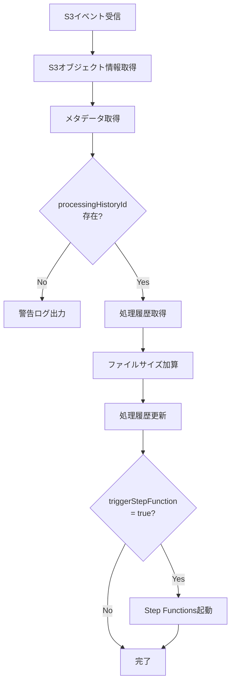

# S3 Event Handler Lambda

S3にファイルがアップロードされた際に自動実行されるLambda関数です。

## 機能

1. S3からメタデータを取得
2. `processingHistoryId`を使って処理履歴を取得
3. ファイルサイズを取得
4. 処理履歴を更新（`usageAmountBytes`を累積加算）
5. `triggerStepFunction='true'`の場合、Step Functionsを起動

## 環境変数

| 変数名 | 説明 | デフォルト値 |
|--------|------|-------------|
| `DYNAMODB_TABLE_NAME` | DynamoDBテーブル名 | `siftbeam-processing-history` |
| `STEP_FUNCTION_ARN` | Step FunctionsのARN | `''` (空文字) |
| `AWS_REGION` | AWSリージョン | `ap-northeast-1` |

## S3イベント設定

### イベントタイプ

- `s3:ObjectCreated:*` - すべてのオブジェクト作成イベント

### プレフィックスフィルター

```
service/input/
```

### サフィックスフィルター

なし（すべてのファイルタイプ）

## S3メタデータ要件

アップロードされたS3オブジェクトには以下のメタデータが必要です:

| キー | 必須 | 説明 |
|------|------|------|
| `processingHistoryId` | ✅ | 処理履歴ID |
| `customerId` | ✅ | カスタマーID |
| `policyId` | ✅ | ポリシーID |
| `triggerStepFunction` | ❌ | Step Functionsトリガーフラグ（`true`/`false`） |

**注意**: S3メタデータのキーは自動的に小文字に変換されます。

## 処理フロー



## DynamoDB更新内容

### 更新フィールド

| フィールド | 更新内容 |
|-----------|---------|
| `usageAmountBytes` | 現在の値 + 新しいファイルサイズ |
| `fileSizeBytes` | 現在の値 + 新しいファイルサイズ |
| `updatedAt` | 現在時刻（ISO 8601形式） |

### 更新式

```python
UpdateExpression="SET usageAmountBytes = :usage, fileSizeBytes = :fileSize, updatedAt = :updatedAt"
```

## Step Functions起動

### 起動条件

1. `triggerStepFunction='true'`がメタデータに設定されている
2. `STEP_FUNCTION_ARN`環境変数が設定されている

### 実行名

```
{processingHistoryId}-{timestamp}
```

例: `550e8400-e29b-41d4-a716-446655440000-1706345400`

### 入力データ

```json
{
  "processingHistoryId": "550e8400-e29b-41d4-a716-446655440000",
  "customerId": "customer-001",
  "policyId": "policy-123",
  "s3Bucket": "siftbeam",
  "s3Key": "service/input/customer-001/550e8400-e29b-41d4-a716-446655440000/document.pdf",
  "fileSize": 1024000
}
```

## エラーハンドリング

### 個別レコードエラー

- 個別のS3レコード処理でエラーが発生しても、他のレコードの処理は継続されます
- エラーはCloudWatch Logsに記録されます

### Step Functions起動エラー

- Step Functions起動に失敗しても、処理履歴の更新は完了します
- エラーはCloudWatch Logsに記録されます

## レスポンス形式

### 成功時

```json
{
  "statusCode": 200,
  "body": {
    "processedCount": 3,
    "totalRecords": 3,
    "triggeredStepFunctions": [
      "550e8400-e29b-41d4-a716-446655440000"
    ]
  }
}
```

### エラー時

```json
{
  "statusCode": 500,
  "body": {
    "error": "Error message"
  }
}
```

## デプロイ

```bash
cd lambda/s3-event-handler
./deploy.sh
```

## IAMポリシー

Lambda関数には以下の権限が必要です:

- `s3:GetObject` - S3オブジェクトの取得
- `s3:GetObjectMetadata` - S3オブジェクトメタデータの取得
- `dynamodb:GetItem` - 処理履歴の取得
- `dynamodb:UpdateItem` - 処理履歴の更新
- `states:StartExecution` - Step Functionsの起動
- `logs:CreateLogGroup` - CloudWatch Logsの作成
- `logs:CreateLogStream` - CloudWatch Logsの作成
- `logs:PutLogEvents` - CloudWatch Logsへの書き込み

詳細は `iam-policy.json` を参照してください。

## 使用例

### ブラウザ版アップロード

```typescript
// ServiceFileUploader.tsx
const uploadResult = await uploadServiceFileToS3({
  file: fileItem.file,
  customerId,
  userId,
  policyId,
  processingHistoryId,
  fileType: 'input',
  isLastFile: true  // 最後のファイル
});
```

S3メタデータ:
```json
{
  "customerId": "customer-001",
  "userId": "user-123",
  "policyId": "policy-456",
  "processingHistoryId": "550e8400-e29b-41d4-a716-446655440000",
  "fileType": "input",
  "uploadedAt": "2025-01-27T10:30:00.000Z",
  "triggerStepFunction": "true"
}
```

### API版アップロード

```python
# api-upload/handler.py
s3_client.put_object(
    Bucket=S3_BUCKET_NAME,
    Key=s3_key,
    Body=file_data,
    ContentType=content_type,
    Metadata={
        'customerId': customer_id,
        'userId': api_key_id,
        'policyId': policy_id,
        'processingHistoryId': processing_history_id,
        'fileType': 'input',
        'uploadedAt': now,
        'triggerStepFunction': 'true'
    }
)
```

## 複数ファイルアップロード

### 最後のファイルのみStep Functionsを起動

ブラウザ版では、複数ファイルをアップロードする際、最後のファイルのみ`triggerStepFunction='true'`を設定します:

```typescript
for (let i = 0; i < files.length; i++) {
  const isLastFile = i === files.length - 1;
  
  await uploadServiceFileToS3({
    file: fileItem.file,
    customerId,
    userId,
    policyId,
    processingHistoryId,
    fileType: 'input',
    isLastFile  // 最後のファイルのみtrue
  });
}
```

これにより:
1. すべてのファイルで`usageAmountBytes`が累積加算される
2. 最後のファイルのみStep Functionsが起動される
3. Step Functionsは全ファイルのアップロード完了後に実行される

## ログ出力

### 正常処理

```
Event received: {...}
Processing S3 object: s3://siftbeam/service/input/customer-001/550e8400-e29b-41d4-a716-446655440000/document.pdf (size: 1024000 bytes)
Metadata: {"processinghistoryid": "550e8400-e29b-41d4-a716-446655440000", ...}
Content-Length: 1024000
Processing History ID: 550e8400-e29b-41d4-a716-446655440000
Customer ID: customer-001
Policy ID: policy-123
Trigger Step Function: true
Current processing history: {...}
Updating usage: 0 + 1024000 = 1024000 bytes
Processing history updated successfully: 550e8400-e29b-41d4-a716-446655440000
Starting Step Functions execution: 550e8400-e29b-41d4-a716-446655440000-1706345400
Input: {...}
Step Functions execution started: arn:aws:states:...
Processed 1/1 records
Triggered Step Functions for: ['550e8400-e29b-41d4-a716-446655440000']
```

### エラー

```
Error processing record: ...
Traceback (most recent call last):
  ...
Warning: processingHistoryId not found in metadata for service/input/...
```

## テスト

### ローカルテスト

```python
# test_handler.py
import json
from handler import lambda_handler

event = {
    "Records": [
        {
            "s3": {
                "bucket": {"name": "siftbeam"},
                "object": {
                    "key": "service/input/customer-001/550e8400-e29b-41d4-a716-446655440000/document.pdf",
                    "size": 1024000
                }
            }
        }
    ]
}

result = lambda_handler(event, None)
print(json.dumps(result, indent=2))
```

### AWS CLIでテスト

```bash
aws lambda invoke \
  --function-name siftbeam-s3-event-handler \
  --payload file://test-event.json \
  --region ap-northeast-1 \
  response.json

cat response.json
```

## 注意事項

- S3メタデータのキーは自動的に小文字に変換されます（`processingHistoryId` → `processinghistoryid`）
- ファイルサイズは累積加算されるため、複数ファイルアップロードに対応しています
- Step Functions起動エラーは記録されますが、処理履歴の更新は完了します
- 処理履歴が見つからない場合は警告ログを出力しますが、エラーにはなりません

